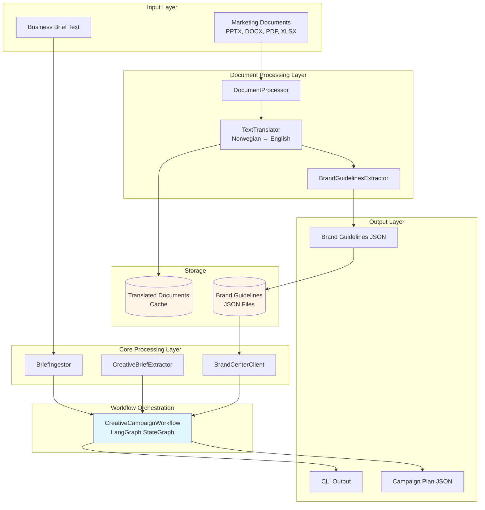
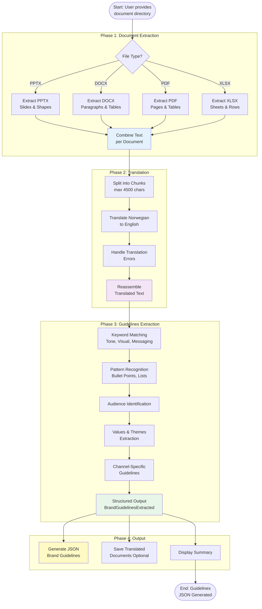
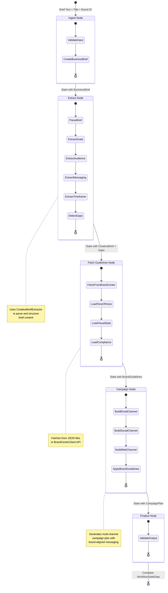
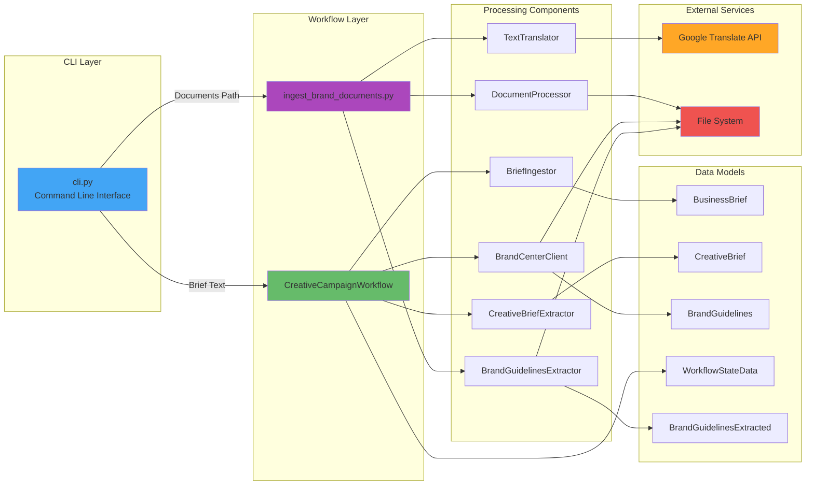
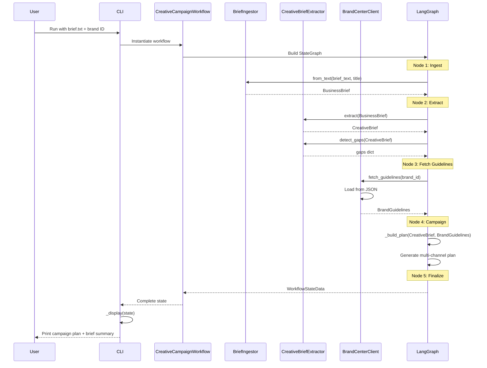
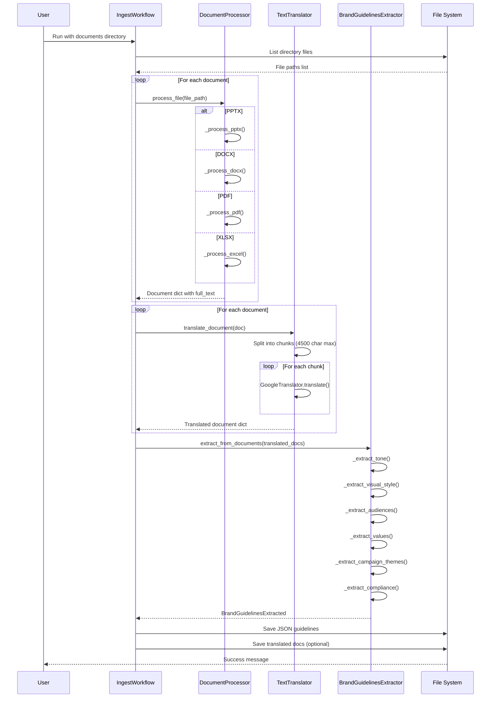
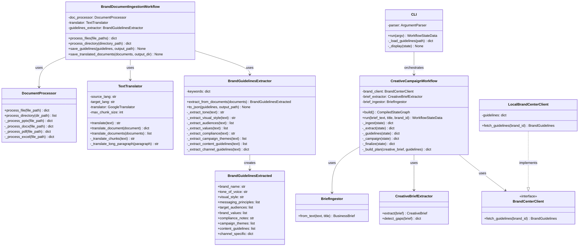
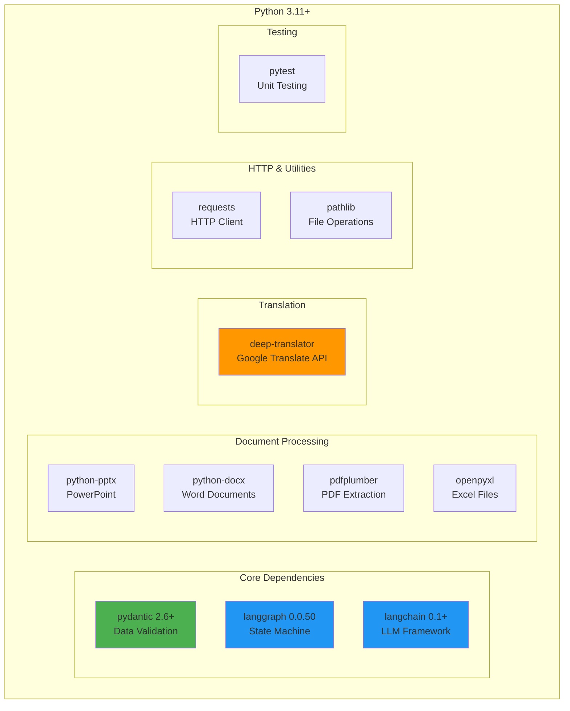

# Mark Lang Architecture & Process Flow Diagrams

## System Architecture



## Document Ingestion Workflow



## Campaign Workflow Process (LangGraph)



## Component Interaction Diagram



## Data Flow: Brief to Campaign Plan



## Data Flow: Documents to Brand Guidelines



## Class Hierarchy



## Technology Stack



---

## Execution Flow Example

### Example 1: Processing a Business Brief

```
User Input: examples/brief.txt + --brand dnb
    ↓
CLI.run()
    ↓
CreativeCampaignWorkflow.run()
    ↓
StateGraph Execution:
    1. Ingest Node → BusinessBrief(title="brief", goals=..., audience=...)
    2. Extract Node → CreativeBrief(goals="Expand into Nordic SMB", ...)
    3. Fetch Guidelines Node → BrandGuidelines(tone="Professional and trustworthy", ...)
    4. Campaign Node → campaign_plan = { channels: [email, social, web], ... }
    5. Finalize Node → WorkflowStateData(complete)
    ↓
CLI._display() → Print JSON output
```

### Example 2: Ingesting Brand Documents

```
User Input: documents directory path
    ↓
BrandDocumentIngestionWorkflow.process_directory()
    ↓
Phase 1: Extract
    For each file → DocumentProcessor.process_file()
        → {file_name, file_type, full_text, ...}
    ↓
Phase 2: Translate
    For each document → TextTranslator.translate_document()
        → Split into chunks → Google Translate API
        → Reassemble translated text
    ↓
Phase 3: Extract Guidelines
    BrandGuidelinesExtractor.extract_from_documents()
        → Keyword matching (tone, visual, messaging, ...)
        → Pattern recognition (bullets, lists, ...)
        → BrandGuidelinesExtracted(tone_of_voice=..., visual_style=..., ...)
    ↓
Phase 4: Output
    Save to examples/dnb_brand_guidelines.json
    Save translated docs to examples/translated/
```
